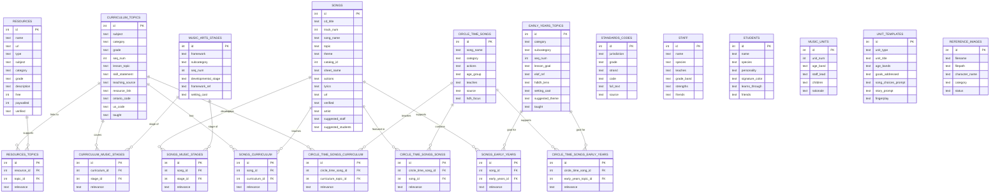

# curriculum.db — Source Data Schema (ER Diagram)

> **Single source of truth.** Human-edited, version-controlled data.
> All other exported data (Excel, generated lessons) derives from this DB.

```mermaid
erDiagram
    CURRICULUM_TOPICS ||--o{ SONGS_CURRICULUM : "has"
    CURRICULUM_TOPICS ||--o{ RESOURCES_TOPICS : "links to"
    CURRICULUM_TOPICS ||--o{ CIRCLE_TIME_SONGS_CURRICULUM : "maps"
    CURRICULUM_TOPICS ||--o{ CURRICULUM_MUSIC_STAGES : "covers"
    SONGS ||--o{ SONGS_CURRICULUM : "teaches"
    SONGS ||--o{ SONGS_EARLY_YEARS : "supports"
    SONGS ||--o{ SONGS_MUSIC_STAGES : "develops"
    SONGS ||--o{ CIRCLE_TIME_SONGS_SONGS : "featured in"
    RESOURCES ||--o{ RESOURCES_TOPICS : "supports"
    CIRCLE_TIME_SONGS ||--o{ CIRCLE_TIME_SONGS_CURRICULUM : "teaches"
    CIRCLE_TIME_SONGS ||--o{ CIRCLE_TIME_SONGS_EARLY_YEARS : "supports"
    CIRCLE_TIME_SONGS ||--o{ CIRCLE_TIME_SONGS_SONGS : "contains"
    EARLY_YEARS_TOPICS ||--o{ CIRCLE_TIME_SONGS_EARLY_YEARS : "goal for"
    EARLY_YEARS_TOPICS ||--o{ SONGS_EARLY_YEARS : "goal for"
    MUSIC_ARTS_STAGES ||--o{ SONGS_MUSIC_STAGES : "stage of"
    MUSIC_ARTS_STAGES ||--o{ CURRICULUM_MUSIC_STAGES : "stage of"

    CURRICULUM_TOPICS {
        int id PK
        text subject
        text category
        text grade
        int seq_num
        text lesson_topic
        text skill_statement
        text teaching_source
        text resource_link
        text ontario_code
        text us_code
        text taught
    }
    SONGS {
        int id PK
        text cd_title
        int track_num
        text song_name
        text topic
        text theme
        int catalog_id
        text sheet_name
        text actions
        text lyrics
        text url
        text verified
        text artist
        text suggested_staff
        text suggested_students
    }
    RESOURCES {
        int id PK
        text name
        text url
        text type
        text subject
        text category
        text grade
        text description
        int free
        int paywalled
        text verified
    }
    STANDARDS_CODES {
        int id PK
        text jurisdiction
        text grade
        text strand
        text code
        text full_text
        text source
    }
    CIRCLE_TIME_SONGS {
        int id PK
        text song_name
        text category
        text actions
        text age_group
        text teaches
        text source
        text hdh_focus
    }
    EARLY_YEARS_TOPICS {
        int id PK
        text category
        text subcategory
        int seq_num
        text lesson_goal
        text elof_ref
        text hdldh_lens
        text setting_cast
        text suggested_theme
        text taught
    }
    STAFF {
        int id PK
        text name
        text species
        text teaches
        text grade_band
        text strengths
        text friends
    }
    STUDENTS {
        int id PK
        text name
        text species
        text personality
        text signature_color
        text learns_through
        text friends
    }
    MUSIC_ARTS_STAGES {
        int id PK
        text framework
        text subcategory
        int seq_num
        text developmental_stage
        text framework_ref
        text setting_cast
    }
    MUSIC_UNITS {
        int id PK
        int unit_num
        text age_band
        text staff_lead
        text children
        text rationale
    }
    UNIT_TEMPLATES {
        int id PK
        text unit_type
        text unit_title
        text age_bands
        text goals_addressed
        text song_choices_prompt
        text story_prompt
        text fingerplay
    }
    REFERENCE_IMAGES {
        int id PK
        text filename
        text filepath
        text character_name
        text category
        text status
    }

    SONGS_CURRICULUM {
        int id PK
        int song_id FK
        int curriculum_id FK
        text relevance
    }
    RESOURCES_TOPICS {
        int id PK
        int resource_id FK
        int topic_id FK
        text relevance
    }
    CIRCLE_TIME_SONGS_CURRICULUM {
        int id PK
        int circle_time_song_id FK
        int curriculum_topic_id FK
        text relevance
    }
    CIRCLE_TIME_SONGS_EARLY_YEARS {
        int id PK
        int circle_time_song_id FK
        int early_years_topic_id FK
        text relevance
    }
    CIRCLE_TIME_SONGS_SONGS {
        int id PK
        int circle_time_song_id FK
        int song_id FK
        text relevance
    }
    SONGS_EARLY_YEARS {
        int id PK
        int song_id FK
        int early_years_id FK
        text relevance
    }
    SONGS_MUSIC_STAGES {
        int id PK
        int song_id FK
        int stage_id FK
        text relevance
    }
    CURRICULUM_MUSIC_STAGES {
        int id PK
        int curriculum_id FK
        int stage_id FK
        text relevance
    }
```
